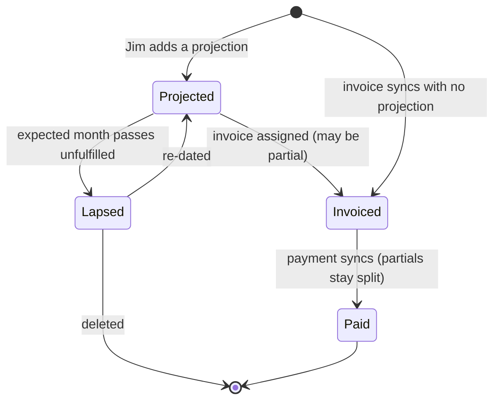

# Income as a pipeline: projections, invoices, cash

## Summary

Replace the blended income rows with a pipeline of items — projections (hoped-for work, by client), invoices (promises, synced from Xero), and payments (cash) — linked into chains as work moves from hope to money. The grid rolls income up by client with each layer separately totalled, and the chart draws two balance lines: a committed line (cash plus invoices sent) as the headline, and an optimistic line showing what unfulfilled projections would add.

---

## Problem Frame

The dashboard shows one number per account per month, blending money received, money promised, and money hoped for. In July that produced a £93k income figure Jim could not decompose: £21k of it was a stale manual projection for a client he no longer works with, part was old invoices whose payment had not synced, and only a fraction was cash. A projection, once saved, lives forever with nothing marking it as unfulfilled hope; an invoice and its payment are invisible as distinct states. The cost is real: the balance chart and "drops below £0" absorb fantasy numbers, so the one thing a cashflow tool must do — tell the truth about money — fails exactly when the picture gets complicated. Jim thinks about income as clients, promises, and payments, not as chart-of-accounts codes; the model should match.

---

## Key Decisions

- **Income is items, not account rows.** Projections, invoices, and payments are first-class items linked into chains (projection → invoice(s) → payment(s)). The monthly grid derives from item states, rolled up by client. Chart-of-accounts codes stop being the organising unit for income.
- **The headline balance never includes hope.** The committed line (cash received plus invoices sent) drives the headline balance and "drops below £0". Projections only extend a second, optimistic line. The gap between the lines is the visible risk.
- **Manual approve/assign, not auto-netting.** When an invoice syncs in, Jim links it to a projection (consuming it) or approves it as standalone. The system never silently retires a projection.
- **Unreviewed invoices still count.** A synced invoice is real money owed; it lands in the committed line immediately and carries an unreviewed flag until triaged. The committed line can never understate reality because of pending admin.
- **Projections lapse instead of lingering.** A projection whose expected month passes without being fully invoiced becomes lapsed: out of the optimistic line, queued for re-dating or deletion. Stale hope surfaces itself.
- **Existing saved projections are binned, not migrated.** Today's income overrides are per-account monthly amounts; the new model's projections are client-level items. Jim re-enters the few real ones at cutover.

Item lifecycle:

---

## Actors

- A1. Jim — creates and prunes projections, triages incoming invoices, reads the grid and chart.
- A2. Xero sync — delivers invoices and payments; the source of the invoiced and paid layers.
- A3. Agent consumers (MCP/OpenClaw) — read the same layered data and must be able to distinguish the layers.

---

## Key Flows

- F1. Invoice pops in
  - **Trigger:** Sync delivers a new ACCREC invoice.
  - **Steps:** Invoice appears in the invoiced layer and moves the committed line immediately; it shows as unreviewed; Jim links it to a projection (reducing that projection's remainder) or approves it standalone.
  - **Outcome:** Committed truth updated instantly; pipeline tidiness follows at Jim's pace.
- F2. Projection life
  - **Trigger:** Jim records expected work (client, amount, expected month).
  - **Steps:** The projection joins the optimistic layer for its month; assigned invoices eat its remainder; if its month ends unfulfilled it lapses and queues for re-date or deletion.
  - **Outcome:** Hope is visible, consumable, and self-expiring.
- F3. Money arrives
  - **Trigger:** Sync delivers a payment against an invoice.
  - **Steps:** The paid amount moves from the invoiced layer to the paid layer on the payment date; partial payments split the invoice across both layers.
  - **Outcome:** Cash is distinguishable from promises without leaving the grid.
- F4. Reading a month
  - **Trigger:** Jim opens the dashboard.
  - **Steps:** Each month shows per-client rollups with the three layer subtotals; the chart shows committed and optimistic lines diverging into the future.
  - **Outcome:** For any month, real vs owed vs hoped is readable at a glance.

---

## Requirements

**Pipeline model**

- R1. Income is represented as items with a lifecycle: projected → invoiced → paid, plus a lapsed state for unfulfilled projections.
- R2. Projections are client-level items with an amount and an expected month, created and edited in the app.
- R3. Invoices sync from Xero as items and can be manually assigned to a projection; assignment reduces the projection's remainder, floored at zero.
- R4. Payments attach to their invoice; partial payments split an invoice between the invoiced and paid layers by amount.
- R5. A projection whose expected month ends before it is fully invoiced becomes lapsed: excluded from the optimistic layer and queued for re-dating or deletion.

**Grid**

- R6. The income section rolls up by client per month with three visually distinct layers (paid, invoiced, projected) and per-layer subtotals.
- R7. Non-invoice income (interest, ad-hoc receive-money) appears in the paid layer automatically as unlinked cash.
- R8. Unreviewed invoices are visually flagged until approved or assigned.

**Balance**

- R9. The committed balance line uses cash received plus invoices sent; it drives the headline balance and "drops below £0".
- R10. The optimistic balance line adds unfulfilled projection remainders to the committed line.
- R11. Overdue invoices count in the committed line at their expected payment date (or due date) floored to the current month, and are flagged overdue.

**Cutover**

- R12. Existing income projection overrides are retired at cutover; the costs section keeps the current model.

---

## Acceptance Examples

- AE1. Stale hope surfaces. **Covers R5, R10.** Given a £21k projection for a client with no invoice assigned, when its expected month ends, then it leaves the optimistic line and appears as lapsed awaiting re-date or delete.
- AE2. Promises count instantly. **Covers R8, R9.** Given a new £5k invoice syncs in, when Jim has not yet triaged it, then the committed line already includes it and the invoice shows an unreviewed flag.
- AE3. Assignment nets hope. **Covers R3.** Given a £45k projection and a £20k invoice assigned to it, then the projected layer shows £25k remaining and the invoiced layer £20k.
- AE4. Partial payment splits. **Covers R4.** Given a £12k invoice with £5k paid, then the paid layer shows £5k on the payment date and the invoiced layer £7k remaining.
- AE5. Two lines tell the risk. **Covers R9, R10.** Given £10k cash trajectory, £8k invoices outstanding, and £30k unfulfilled projections, then the committed line reflects £18k of future truth and the optimistic line sits £30k above it.

---

## Success Criteria

- For any month, Jim can read real vs owed vs hoped without clicking into anything.
- The headline balance and "drops below £0" never move because of a projection.
- A projection that never converts surfaces itself within one month of lapsing; no more forgotten £21k ghosts.

---

## Scope Boundaries

**Deferred for later**

- Costs as a pipeline (bills mirror the same model) — prove it on income first.
- Any relationship with the existing what-if scenarios feature — its item-level entries are a design precedent, not a merge target yet.
- Forecast engine (`get_forecast`) alignment with the new income semantics.

**Outside this product's identity**

- Writing back to Xero (raising invoices from projections).
- Accrual-basis P&L reporting; Xero owns that view.

---

## Dependencies / Assumptions

- The cash-basis rebuild (payments sync, status heal) is deployed and the one-off full+heal sync has run; the paid layer is only as truthful as that data. As of writing, production still serves the pre-rebuild build and the heal has not run.
- Breaking the current API response shape is acceptable: every consumer (web, MCP) lives in this repo and changes in the same release.
- Single user, GBP; no concurrent-editing concerns.

---

## Outstanding Questions

**Deferred to Planning**

- Whether pipeline items reuse or deliberately avoid the existing scenario-items entity (item-level income/expense rows already exist for scenarios: `apps/api/supabase/migrations/001_initial_schema.sql` L86-97, `apps/api/src/app/api/scenarios/[id]/items/route.ts`).
- How client rollups map to Xero data (contact on the invoice vs revenue account code) and what "client" means for a projection with no invoice yet.
- Grid and mobile presentation of the three layers; how the review flag and lapsed queue surface in the UI.
- What the MCP tools expose so agent consumers can read the layers (A3).

---

## Sources / Research

- Grounding dossier (session artifact): `/tmp/compound-engineering/ce-brainstorm/floaters-income/grounding.md`.
- Current blend logic and balance walk: `apps/api/src/app/api/cashflow/route.ts`; single-series chart: `apps/web/src/components/AlignedChart.tsx`; frozen contract: `packages/types/src/index.ts`.
- Layer data already synced: invoices with statuses and partial-payment fields (`apps/api/supabase/migrations/001_initial_schema.sql`), payments (`apps/api/supabase/migrations/006_payments.sql`).
- Projections today: `projection_overrides` per-account-month amounts, minimum zero (`apps/api/src/app/api/projection-overrides/route.ts`).
