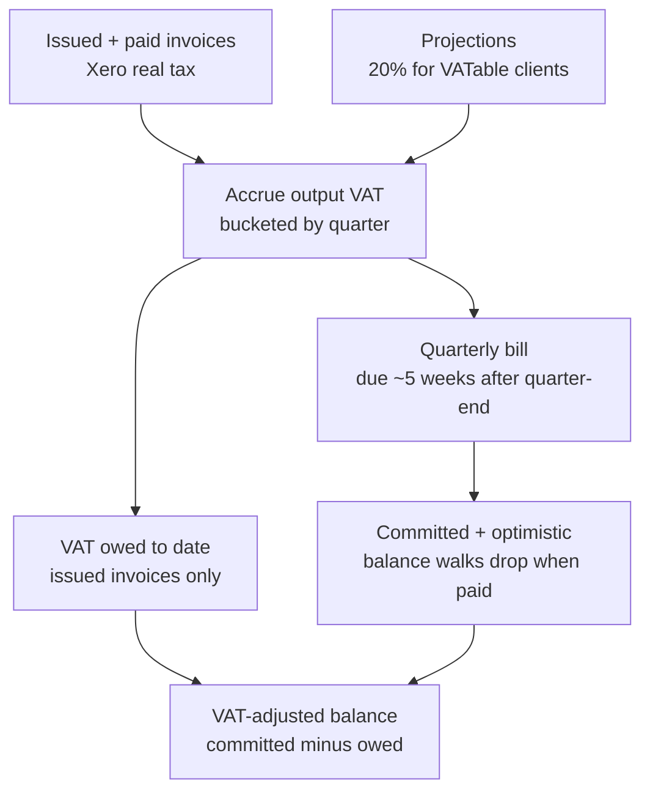

# VAT modelling in the floaters cashflow forecast

## Summary

Make the floaters forecast account for the VAT Flux owes HMRC, so the committed balance stops overstating available cash. VAT is read straight from Xero on real invoices and applied at 20% to VATable clients' projections, accrued per quarter, then dropped as a lump cash outflow when each quarterly bill falls due. The dashboard gains a dedicated VAT payment row, a running "VAT owed to date" figure, and a VAT-adjusted balance line showing true spendable cash.

## Problem Frame

The forecast currently ignores VAT liability entirely. It counts the full VAT-inclusive cash coming in but never subtracts the quarterly VAT payment going out, so the committed balance line runs too high by roughly the accrued-but-unpaid VAT. For a tool whose whole job is "do I have the money", that is a real hole: the headline number is the one figure Jim leans on, and it silently overstates what he can actually spend.

Verified in the code as of 2026-07-07: `xero_invoices` stores the VAT-inclusive `total` and `amount_due` / `amount_paid` but no invoice-level tax figure; there is no per-client VATable flag anywhere; the cashflow route has no VAT accrual and no quarterly VAT bucket; and `income_projections` are entered VAT-inclusive with no way to split out the VAT portion.

## Key Decisions

- **Standard accrual scheme.** Flux is registered on standard accrual VAT, so output VAT is owed on the invoice date (not when paid), input VAT is reclaimable, and the net is paid quarterly. The model mirrors this: accrue as income enters the pipeline, pay the lump when the bill falls due.
- **Output VAT only for v1.** The forecast models the VAT collected on sales and does not net input VAT on costs. This is simpler and errs pessimistic (the modelled bill sits at or above the true bill), which is the safe direction for a "will I run out" tool. Input VAT is a v2 refinement.
- **Trust Xero where it knows, flag where it cannot.** For issued and paid invoices, use the actual tax Xero holds (which already treats out-of-scope clients like IKEA as zero). The per-client VATable flag plus a flat 20% only governs projections, where there is no Xero truth to read.
- **Show the true economic position, not just cash-basis.** Beyond dropping the payment on the forecast, surface how much VAT is currently held-but-owed, and a VAT-adjusted balance, so the balance is never mistaken for spendable money in the weeks before a quarterly hit.

## How VAT flows through the forecast

## Requirements

**VAT computation**

- R1. Output VAT is computed per income item: for issued and paid ACCREC invoices use the actual tax Xero records on the invoice; for income projections apply 20% to VATable clients and zero to non-VATable.
- R2. VATable status is a per-client setting (PropellerNet and Regent Exhibitions VATable; IKEA not). For invoices already in Xero, non-VATable clients carry zero tax and need no flag; the flag governs projections, where there is no Xero data to read.
- R3. Input VAT on costs is not netted in v1. The forecast models output VAT only, so the modelled quarterly bill is at or above the true bill.

**Quarterly liability and payment**

- R4. Output VAT accrues on the accrual basis: a quarter's liability is the output VAT on income dated within that quarter. Flux's quarters end 31 May, 31 Aug, 30 Nov, and 28 (or 29) Feb.
- R5. Each quarter's bill is projected as a single cash outflow due one calendar month and seven days after the quarter-end (the quarter ending 31 Aug is paid by ~7 Oct).
- R6. The VAT payment reduces both the committed and optimistic balance walks, as certain cash out.
- R7. Only quarters not yet paid are projected. A VAT payment already made sits in synced cash history as a bank transaction, so the forecast must not also project it.

**Presentation**

- R8. A dedicated VAT line appears in the costs section, showing zero in most months and the quarterly bill in each payment month.
- R9. A running "VAT owed to date" figure shows output VAT accrued but not yet paid, counting issued invoices in the open quarter (not projections), so Jim can see how much of the current balance is really HMRC's.
- R10. A VAT-adjusted balance line shows true spendable cash: the committed balance minus VAT owed. It sits below the committed line and stays continuous across payment dates, because committed subtracts VAT only when the bill is paid while the adjusted line nets the accrual continuously.

## Acceptance Examples

- AE1. **Covers R1, R2.** An IKEA invoice for £10,000 with no VAT in Xero contributes £0 output VAT. A PropellerNet invoice for £12,000 including VAT contributes the £2,000 tax Xero records.
- AE2. **Covers R1, R2.** A £6,000 projection for Regent (VATable) accrues £1,000 output VAT (6,000 × 1/6). A £5,000 projection for IKEA (non-VATable) accrues £0.
- AE3. **Covers R4, R5.** Income dated in the Jun-Aug quarter carries £30,000 of output VAT, so a £30,000 outflow appears on the forecast at ~7 Oct.
- AE4. **Covers R7.** The Mar-May quarter's bill (due ~7 Jul) has been paid; that payment is already in cash history, so the forecast shows no separate Mar-May VAT outflow.
- AE5. **Covers R10.** On a day when £18,000 of VAT is accrued but unpaid and the committed balance reads £50,000, the VAT-adjusted balance reads £32,000. When the bill is paid, committed drops to about £32,000 and the two lines meet.

## Scope Boundaries

**Deferred for later**

- Input VAT netting (reclaim on costs). A v2 refinement once the output-VAT model is proven; it would need the tax on Xero bills plus an assumed rate on forecast and averaged costs.

**Outside this product's identity**

- Not a VAT-return or filing tool: no MTD submission, no VAT registration threshold tracking, no reconciliation against filed returns.
- No support for other schemes (flat-rate, cash accounting). Flux is on standard accrual; the tool forecasts the cash impact of that, nothing more.

## Dependencies / Assumptions

- Reading real per-invoice VAT (R1) depends on adding the invoice-level tax to the Xero sync. It is not synced today (only the VAT-inclusive `total` is), so this is a prerequisite.
- Invoices already synced will not carry tax until a re-sync or heal pulls the tax field for them.
- The standard rate is assumed to be 20% for projections; real invoices use whatever Xero records.
- A projection's accrual month is proxied by its expected income month, as projections carry no separate expected-invoice date.
- The per-client VATable flag applies cleanly to contact-linked income; projections keyed to a free-text label or left unassigned need a home for the flag (see Outstanding Questions).

## Outstanding Questions

**Deferred to planning**

- Where the VATable flag lives for projections not tied to a Xero contact (label-keyed or unassigned), and what the default is for unassigned income.
- Exact accrual bucketing for projections near a quarter boundary: proxying the invoice date to the expected income month can misplace a projection's VAT by one quarter.
- How the double-count guard (R7) identifies an already-paid VAT bill in cash history, given VAT payments to HMRC arrive as ordinary untagged bank transactions.
- How to render the VAT-adjusted line alongside the existing committed and optimistic lines without cluttering the chart (always-on, a toggle, or lighter styling).
