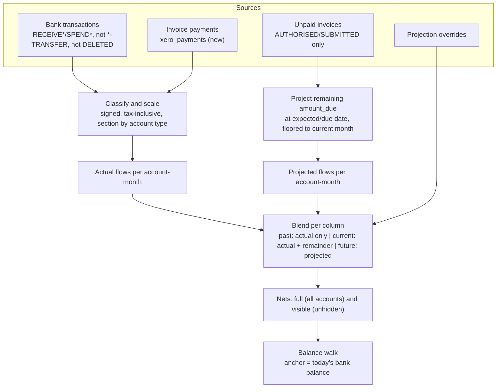
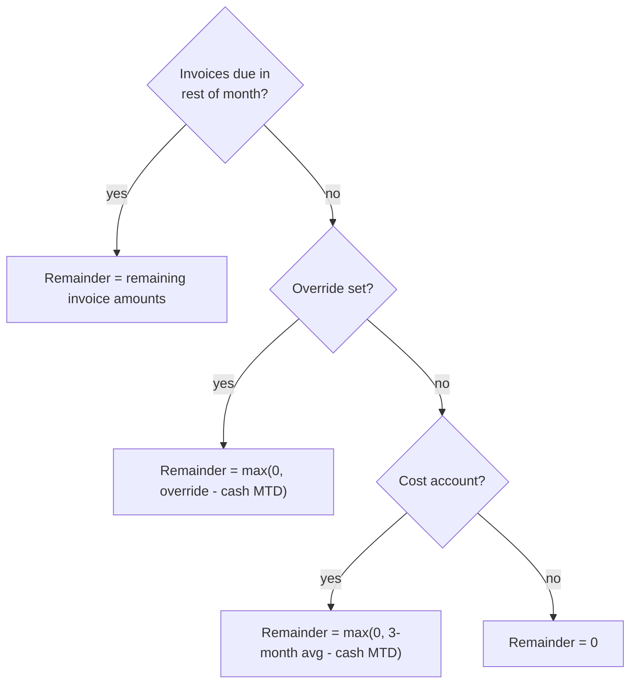

# fix: Cashflow cash-basis history and balance reconstruction

## Summary

Rebuild the cashflow dashboard on a Float-style basis model: history months show only actual cash (bank transactions plus newly-synced invoice payments), future months show expected cash, and the current month blends actual cash to date with a clearly-flagged projected remainder. Rebuild the opening/closing balance walk on those corrected flows, and heal the Xero sync so invoices paid or voided in Xero stop lingering locally as expected income.

---

## Problem Frame

Past opening balances render as large negative figures and the live month is a confusing mash-up. Root cause (confirmed by reading `apps/api/src/app/api/cashflow/route.ts`): the endpoint is an accidental hybrid of cash and accrual. Unpaid invoices are bucketed by due month with no floor at today, so overdue invoices land in past months merged with real bank flows and are shown as non-projected actuals. The balance computation anchors the current month's closing at the live bank balance and walks backwards subtracting those inflated nets, pushing every earlier balance down. Compounding it: `Math.abs()` flattens signed amounts, partially-paid invoices double-count (full `LineAmount` while the paid part is already in bank transactions), hidden accounts are removed from nets but not from the balance anchor, and the sync never re-fetches invoices once they go PAID (or VOIDED/DELETED) in Xero, so stale "unpaid" rows project phantom income forever.

One further gap shapes the whole fix: in Xero, payments against invoices are not bank transactions (they live on the separate Payments endpoint, which this app has never synced). A pure-cash history therefore needs payments synced, otherwise history income is nearly empty and past balances drift high instead of low.

---

## Requirements

Basis and history:

- R1. Past months contain only actual cash flows: bank transactions (excluding transfers and deleted transactions) and invoice payments on their payment dates. No unpaid-invoice amounts appear in any past month.
- R2. Invoice payments sync from Xero's Payments endpoint into a new `xero_payments` table and are attributed to P&L accounts via the paid invoice's line items, prorated and tax-inclusive.

Projection rules:

- R3. Only AUTHORISED and SUBMITTED invoices project. DRAFT, VOIDED, DELETED and PAID never contribute to any column.
- R4. An unpaid invoice projects in the month of `expected_payment_date || due_date`, floored to the current month (overdue rolls forward, never backwards).
- R5. A partially-paid invoice projects only its remaining `amount_due`, prorated across its line items.
- R6. Known invoice data wins over a manual override by presence, not by `> 0`, so a month whose invoices net negative (credit-heavy) is not silently replaced by an override or average.

Current month:

- R7. Each current-month cell shows actual cash month-to-date plus a projected remainder. Remainder precedence: invoices due in the rest of the month win; else an override is treated as the expected month total (remainder = max(0, override minus cash MTD)); else cost accounts project max(0, 3-month average minus cash MTD); income accounts get no invented remainder. Cells with a projected component have `isProjected = true`, and `hasOverride` is reported truthfully for the current month.
- R8. The current month's opening balance equals today's bank balance minus the cash-only month-to-date net (which is also the previous month's closing); its closing balance equals today's bank balance plus the projected remainder net (a projected month-end).

Balances:

- R9. For every month, closing minus opening equals that month's published net cash movement, and the historical walk uses cash-only nets.
- R10. Hidden accounts are excluded from the visible rows but included in net movement and balance maths. Accepted consequence: visible section totals may not sum to the net row when accounts are hidden.
- R11. Flows are signed (no `Math.abs`): refunds and credit lines reduce their section, and flows are scaled to tax-inclusive totals so monthly nets match real balance deltas.

Sync heal:

- R12. Incremental invoice sync picks up PAID/VOIDED/DELETED status changes (always bounded by `UpdatedDateUTC`), `POST /api/sync` runs incrementally when `last_synced_at` exists, and a bounded one-off heal refreshes existing stale local rows.

Contract and robustness:

- R13. The response contract is unchanged: no fields renamed or removed, `fallsBelowZeroIn` keeps its exact string format ("This month" / "1 month" / "N months"). `back`/`forward` are validated (back >= 0, forward >= 1, integers) and window edges cannot crash the balance walk.
- R14. MCP tool descriptions, `apps/mcp/README.md` and `CLAUDE.md` describe the new semantics.

---

## Key Technical Decisions

- **Float basis model**: cash history, expected-cash future, blended current month. This is the model the app was cloned from and the only one in which "anchor on today's balance and walk both ways" is arithmetically sound.
- **Sync the Payments endpoint** (user-selected over the PAID-invoice proxy): exact cash timing including partial payments, at the cost of a new table and migration. Payments are attributed to accounts through the linked invoice's line items, prorated.
- **Overdue rolls forward using `expected_payment_date || due_date`**: consistent with the existing adjustments feature (`apps/api/src/app/api/adjustments/[id]/route.ts`) and with the forecast engine's date preference. The engine itself is intentionally untouched; it currently drops overdue invoices silently, and aligning it is deferred follow-up work.
- **Separate actual and projected accumulations**: the route builds two per-account-per-month maps instead of one, so history stays pure cash, the current month can blend, and per-cell `isProjected` is derived from the presence of a projected component rather than from column position.
- **Sync heal is bounded, never unbounded**: the status exclusions (`PAID`, `VOIDED`, `DELETED`) are dropped only for `UpdatedDateUTC`-bounded fetches. `POST /api/sync` currently always runs a full sync (`apps/api/src/app/api/sync/route.ts`); it must pass incremental when `last_synced_at` exists. The one-off heal re-fetches the local AUTHORISED/SUBMITTED rows in `Invoices?IDs=` batches, which is exact and bounded.
- **Tax-inclusive scaling**: line items are tax-exclusive while `total`/`amount_due` are tax-inclusive. Scale each document's line items by `total / sum(LineAmount)` (guarding zero sums) so bucketed cash sums to what actually moved; invoice projections scale to the remaining tax-inclusive amount.
- **Direction and exclusion rules**: transaction direction comes from prefix-matched types (`RECEIVE*` inflow, `SPEND*` outflow, `*-TRANSFER` excluded entirely); DELETED bank transactions are excluded; line items referencing BANK accounts are dropped (internal transfers); line items referencing unknown or inactive accounts go to the UNCATEGORISED bucket so nets stay truthful.
- **Two nets internally**: a full net (all accounts, drives balances and `fallsBelowZeroIn`) and a visible net (drives nothing yet, but keeps the row maths explicit). Hidden accounts affect only the full net.
- **Contract stays frozen**: no new fields. The web already renders per-cell `isProjected`/`hasOverride`, and balance-row projected-ness is derivable from `currentMonthIndex`. The one semantic shift consumers see is that the current month's closing is a projected month-end rather than "balance right now"; `currentBalance` remains today's balance.
- **Chart split moves one segment**: `AlignedChart` draws solid through the current month's point, which is now projected. Deliberate choice: end the solid line at the previous month's closing and start the dashed segment there.

---

## High-Level Technical Design

Data pipeline (directional guidance, not implementation specification):

Current-month remainder precedence per account:

Month-column semantics:

| Column | Flows shown | isProjected | Balance meaning |
|---|---|---|---|
| Past | Actual cash only (bank txns + payments) | false | Reconstructed backwards from the anchor using cash-only nets |
| Current | Cash MTD plus projected remainder | true where a projected component exists | Opening = today minus cash-MTD net; closing = today plus remainder net (projected month-end) |
| Future | Projected (invoice wins, then override, then cost average) | true | Walked forward from the current month's closing |

---

## Implementation Units

### U1. Sync invoice payments from Xero

**Goal:** Invoice-payment cash exists locally so history months can show real income and outgoings.

**Requirements:** R1, R2.

**Dependencies:** none.

**Files:** `apps/api/supabase/migrations/006_payments.sql` (new), `apps/api/src/lib/xero/sync.ts`, `apps/api/src/types/xero.ts`, `apps/api/src/lib/xero/sync.test.ts`.

**Approach:** New `xero_payments` table keyed like the other Xero tables on `(connection_id, xero_id)`: invoice xero id, date, amount, status, `xero_updated_at`. Sync it in `runSync` alongside invoices (initial and incremental, `UpdatedDateUTC`-bounded, through the existing bottleneck limiter and `chunkedUpsert`). Payments can be deleted in Xero; store status so reads can exclude DELETED.

**Patterns to follow:** `syncInvoices` in `apps/api/src/lib/xero/sync.ts` (query building, incremental bound, upsert batching), migration style of `apps/api/supabase/migrations/003_account_management.sql`.

**Test scenarios:**
- Initial sync maps a Xero payment payload to a row (amount, date, invoice link, status).
- Incremental sync includes the `UpdatedDateUTC` bound in the query.
- A payment with status DELETED is stored with that status (visible to reads for exclusion).
- Upserts batch on `(connection_id, xero_id)` like the other entities.

**Verification:** After a sync against the real connection, `xero_payments` holds rows whose per-month sums are plausible against the bank statement; `npm test` green from the root.

### U2. Sync heal: paid/voided invoices and genuinely incremental sync

**Goal:** Invoices paid, voided or deleted in Xero stop existing locally as open AUTHORISED rows, and routine syncs stay cheap.

**Requirements:** R3 (data side), R12.

**Dependencies:** none (independent of U1).

**Files:** `apps/api/src/lib/xero/sync.ts`, `apps/api/src/app/api/sync/route.ts`, `apps/api/src/lib/xero/sync.test.ts`.

**Approach:** Incremental invoice fetches drop the `Status!="PAID"` / VOIDED / DELETED exclusions but keep the `UpdatedDateUTC` bound, so status transitions arrive as updates (reads filter by status). The initial-sync filter keeps its exclusions (volume). `POST /api/sync` passes incremental when the connection has `last_synced_at`. One-off heal: re-fetch the connection's local AUTHORISED/SUBMITTED invoices in `Invoices?IDs=` batches and upsert whatever comes back, run once after deploy (a small guarded route or a flag on the sync route; exact trigger is an implementation-time choice).

**Test scenarios:**
- Incremental where-clause includes PAID/VOIDED/DELETED (no status exclusion) and the `UpdatedDateUTC` bound; initial where-clause keeps the exclusions.
- The invoice upsert payload never contains `expected_payment_date` (locally-owned column survives).
- Sync route: with `last_synced_at` set, `runSync` is called incrementally; without it, full.
- Heal path: local open invoices are re-fetched by IDs in batches and updated rows change status.

**Verification:** After the heal runs against the live connection, no local AUTHORISED/SUBMITTED row exists for an invoice that Xero reports as PAID/VOIDED; subsequent Sync Now completes in seconds, not minutes.

### U3. Route: flow classification and aggregation

**Goal:** The cashflow route builds separate actual and projected per-account-month flows with correct signs, scaling and exclusions.

**Requirements:** R1, R3, R4, R5, R11.

**Dependencies:** U1 (payments data), U2 (trustworthy statuses).

**Files:** `apps/api/src/app/api/cashflow/route.ts`, `apps/api/src/app/api/cashflow/route.test.ts`.

**Execution note:** Extend the route test's fixture scaffold with failing cases for the new aggregation before reworking the route.

**Approach:** Fetch payments alongside the existing queries; select `expected_payment_date`, `amount_paid` and `total` on invoices; restrict invoice statuses to AUTHORISED/SUBMITTED. Accumulate into an actual map (bank transactions plus payments, signed, scaled to document totals, direction by type prefix, `*-TRANSFER` and DELETED excluded, BANK-account lines dropped, unknown lines to UNCATEGORISED) and a projected map (remaining `amount_due` prorated across line items, bucketed at `expected_payment_date || due_date` floored to the current month). Bank/payment data for the cost average is fetched from at least three months back regardless of the `back` parameter, so a narrow window doesn't degrade the average.

**Patterns to follow:** Existing route structure (parallel Supabase queries, `addToMap`-style accumulation, `round()` helper, typed `const response` before `return json(response)`); terse why-comments per `CLAUDE.md`.

**Test scenarios:**
- Overdue AUTHORISED invoice due three months ago: appears only in the current month's projected component; its due month shows bank/payment cash only.
- Partially-paid invoice (total 1200, amount_due 600, two line items): projects exactly 600, split pro rata and tax-inclusive.
- DRAFT invoice: contributes nothing anywhere.
- Payment row: lands in its payment month's actual flows, attributed via the invoice's line items.
- SPEND transaction with a REVENUE-account line (refund): reduces income for that month rather than inflating costs or income.
- Line items summing to less than `total` (VAT): bucketed amounts scale to `total`; a zero line-sum document falls back without dividing by zero.
- `RECEIVE-TRANSFER` / `SPEND-TRANSFER` and `status = DELETED` bank transactions: excluded from every bucket.
- Line item referencing an unknown account code: lands in UNCATEGORISED with the transaction's direction.

**Verification:** New tests green alongside the existing route tests (system time pinned to 2026-06-15); root `npm test` green.

### U4. Route: current-month blend and balance walk

**Goal:** Columns follow the month-semantics table and every published balance reconciles.

**Requirements:** R6, R7, R8, R9, R10, R13.

**Dependencies:** U3.

**Files:** `apps/api/src/app/api/cashflow/route.ts`, `apps/api/src/app/api/cashflow/route.test.ts`.

**Execution note:** Write the balance-identity assertions (closing minus opening equals net, for every month) as fixtures first; they are the regression test for the headline bug.

**Approach:** Rework `buildAccounts` around the two maps: past cells from the actual map only (`isProjected` false); current cells actual-plus-remainder with the precedence flow above (`isProjected` true only when a projected component exists, `hasOverride` truthful); future cells keep today's rules but the invoice-wins guard becomes presence-based (R6). Compute full and visible nets; the full net drives the walk and `fallsBelowZeroIn`. Walk: current closing = today's balance plus remainder net; previous month's closing = today's balance minus cash-MTD net; backwards from there on cash-only nets; forwards unchanged. Guard the `currentMonthIndex = 0` edge (no previous-month slot). Validate `back`/`forward` with Zod v4 (`back >= 0`, `forward >= 1`, integers; 400 on failure via the existing `error()` helper).

**Patterns to follow:** Zod usage in `apps/api/src/app/api/projection-overrides/route.ts`; existing walk structure for the forward loop.

**Test scenarios:**
- Balance identity: for a fixture with history, current and future months, `closing[i] - opening[i] === netCashMovement[i]` for every i, and `opening[current]` equals today's balance minus the cash-MTD net.
- Past month with an unpaid overdue invoice: opening balance no longer negative (regression fixture mirroring the reported bug).
- Current month, override 5000 with cash MTD 3000: cell 5000 (`hasOverride` true, `isProjected` true). Override 2000 with cash MTD 3000: cell 3000 (`hasOverride` true, no projected remainder).
- Credit-heavy future month (invoices netting negative) with an override present: invoice data wins (presence-based guard).
- Cost account with cash MTD below its 3-month average: remainder tops up to the average; income account with no invoices/override gets no top-up.
- Hidden account with flows: absent from rows, present in `netCashMovement` and balances.
- Stale override on a past month: ignored (past cells are actual-only), and no phantom all-zero row appears.
- `back=0, forward=1`: no crash, no negative-index writes. `forward=0` or non-numeric params: 400.
- Today's balance positive but projected month-end negative: `fallsBelowZeroIn === "This month"` (exact string).

**Verification:** Full route test suite green; a manual smoke against the live API shows past opening balances tracking the real bank history and the current month reconciling to today's balance.

### U5. Consumers: web tweaks, MCP and docs alignment

**Goal:** Consumers render and describe the new semantics correctly.

**Requirements:** R7 (override editing surface), R14.

**Dependencies:** U4.

**Files:** `apps/web/src/components/AlignedChart.tsx`, `apps/web/src/components/EditableCell.tsx`, `apps/mcp/src/index.ts`, `apps/mcp/README.md`, `CLAUDE.md`, plus a component test beside `EditableCell` following the web vitest/Testing Library setup.

**Approach:** Chart: end the solid line at the previous month's closing, dash from there (current closing is now projected). EditableCell: when `hasOverride` is true, pre-fill the editor with the stored override rather than the blended cell value, so open-then-save doesn't ratchet the override up; current-month cells now show the pencil/reset affordances via truthful `hasOverride`. MCP: update `get_cashflow`'s description (current-month blend, overdue roll-forward) and add a one-line note that `get_forecast` uses the untouched engine and treats overdue differently; same corrections in the README. Update `CLAUDE.md`'s description of the cashflow route.

**Patterns to follow:** Existing chart index-split logic; optimistic-mutation pattern stays untouched (accepted: a brief flicker when the refetched blend differs from the raw override).

**Test scenarios:**
- EditableCell with `hasOverride` true: editor pre-fills the stored override value, not the blended display value.
- EditableCell current-month cell with an override: shows the override affordances (pencil/reset).
- Chart: solid/dashed split lands between the previous and current month (render test on the path props, or `Test expectation: none -- visual styling` if the split proves untestable in jsdom; prefer the render test).

**Verification:** Root `npm run build` green (web build, embed, api build); manual check of the dashboard shows the dashed segment starting at the current month and sensible cell affordances.

---

## Scope Boundaries

In scope: the cashflow dashboard endpoint, the Xero sync additions/heal described above, the minimal web/MCP/doc alignment.

### Deferred to Follow-Up Work

- Forecast engine alignment: `apps/api/src/lib/forecast/engine.ts` silently drops overdue invoices; after this fix it disagrees with the dashboard's current month. Align it (or share the projection logic) in a follow-up.
- Credit notes: not synced; allocated credit notes already reduce `amount_due`, but cash refunds via credit notes remain invisible.
- UNCATEGORISED as an editable pseudo-account (overrides can be persisted against it; it cannot be hidden). Block or embrace deliberately later.
- Negative overrides: the overrides route floors `amount >= 0`; expected-refund months cannot be expressed. Revisit with signed handling bedded in.
- Surfacing BankSummary balance-refresh failures in `sync_log` (today they fail silently, leaving a stale anchor with no signal), and filtering the anchor to ACTIVE bank accounts.
- Hidden-accounts reconciliation UX: a footnote or tooltip explaining why visible section totals may not sum to the net row.
- Multi-currency: amounts are document-currency nominals summed as GBP. Single-tenant GBP assumption stands; conversion is out.

### Outside this product's identity

- Accrual-basis reporting (P&L view). The dashboard is a cash tool; Xero itself is the accrual view.

---

## System-Wide Impact

- **Database**: one new table (`xero_payments`) via migration 006; no changes to existing tables.
- **Sync behaviour**: Sync Now becomes genuinely incremental (faster); a one-off heal plus initial payments backfill runs once (rate-limited by the existing bottleneck; expect the first sync after deploy to be slow).
- **Numbers change visibly**: past balances and the current month will shift materially once phantom income disappears and payments arrive. This is the point, but it will look dramatic on first load; the localStorage cache shows old numbers briefly until the refetch lands.
- **Contract**: unchanged shape; MCP consumers (OpenClaw) see corrected numbers and updated tool descriptions. `get_forecast` and `get_cashflow` may disagree on the current month until the engine follow-up.

---

## Risks & Dependencies

- **Xero rate limits on backfill**: the payments backfill and IDs-batch heal are paced by the existing limiter (~54 calls/min); a large payment history means a long first sync. Mitigation: bounded fetches, run once, off-peak.
- **Attribution gaps**: payments attribute to accounts via their invoice's line items; an invoice with no line items falls back to UNCATEGORISED. Some income granularity may be coarser than the bank statement.
- **Residual reconstruction drift**: cash history is only as complete as bank transactions plus payments; anything Xero exposes elsewhere (manual journals, expense claims) stays invisible. Accepted; the walk anchors on today's balance so drift accumulates only backwards and is bounded by the window.
- **Behavioural pinning**: `fallsBelowZeroIn` string format and the response shape are load-bearing for the web (`getZeroColor` string-matches) and are pinned by R13.

---

## Sources & Research

- Diagnosis: `apps/api/src/app/api/cashflow/route.ts` (bucketing, `Math.abs`, walk), confirmed against `apps/api/src/lib/xero/sync.ts` (status filter, `current_balance` from the BankSummary report) and `apps/api/supabase/migrations/001_initial_schema.sql` (columns available for proration: `total`, `amount_due`, `amount_paid`, `fully_paid_on_date`, `expected_payment_date`).
- Contract and consumers: `packages/types/src/index.ts` (canonical shape, re-exported by API and web), `apps/web/src/pages/CashflowPage.tsx`, `apps/web/src/components/EditableCell.tsx`, `apps/web/src/components/CashflowMobile.tsx`, `apps/web/src/components/AlignedChart.tsx`, `apps/mcp/src/index.ts`.
- Test scaffold to extend: `apps/api/src/app/api/cashflow/route.test.ts` (hoisted fixture state, chainable thenable Supabase mock, system time pinned to 2026-06-15).
- Xero behaviour: invoice payments are exposed via the Payments endpoint, not BankTransactions. The local `XeroBankTransaction` type union (`apps/api/src/types/xero.ts`) covers `RECEIVE`/`SPEND` and their `-OVERPAYMENT`/`-PREPAYMENT` variants only; transfer types (`RECEIVE-TRANSFER`/`SPEND-TRANSFER`) occur in live Xero data, so the union needs extending when U3's exclusion rule leans on it.
