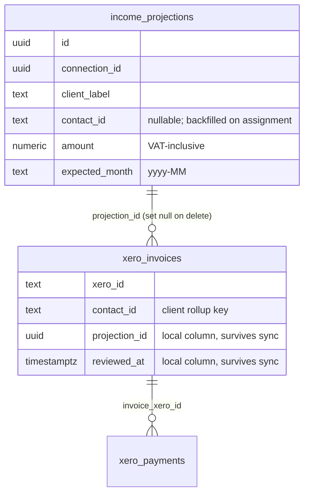

# feat: Income as a pipeline of items

## Summary

Rebuild the income side of the cashflow dashboard as a pipeline of items: client-level projections created in the app, invoices synced from Xero, and payments as cash — linked into chains with a derived lapsed state for unfulfilled projections. The grid rolls income up by client with three layer subtotals (paid, invoiced, projected); the chart gains a committed balance line (cash plus invoices sent, the headline) and an optimistic line (plus unfulfilled projection remainders). Incoming invoices count immediately and queue in a review tray for manual approve/assign. The API response shape breaks deliberately; web and MCP ship in the same release.

---

## Problem Frame

The origin document carries the full framing (see origin: `docs/brainstorms/2026-07-06-income-pipeline-requirements.md`). In short: one blended number per account per month makes stale hope, unpaid promises, and real cash indistinguishable — a £93k July that was mostly a forgotten projection and stale invoices. Jim thinks in clients, promises, and payments; the model should too, and the headline balance must never move because of a projection.

---

## Requirements

Origin requirements R1-R12 apply as written (items and lifecycle R1-R5, grid R6-R8, balance R9-R11, cutover R12). Planning adds the following, discovered during flow analysis:

- R13. Whole-document client truth: ACCREC invoices and their payments appear in the income layers at full document amounts under their client, and their line-level shares are removed from the account-based costs pass; for every historical month, income paid-layer total plus non-invoice income minus costs actuals equals the real bank movement.
- R14. Projection amounts are VAT-inclusive; a projection's remainder nets against assigned invoices' `total` (not `amount_due`), excluding VOIDED and DELETED invoices, floored at zero.
- R15. Client rollup key precedence: `contact_id`, else normalised projection label, else UNASSIGNED; assignment backfills `contact_id` onto a contact-less projection; the key is explicit in the response; display names come from the most recently synced invoice (never key on name).
- R16. Unassign and reassign are first-class; deleting a projection releases its invoices (links nulled, invoices stay reviewed as standalone).
- R17. The review tray shows unreviewed ACCREC invoices in AUTHORISED, SUBMITTED, or PAID-within-30-days; DRAFT and ACCPAY never appear; the cutover migration backfills `reviewed_at` for all pre-existing invoices so the tray starts empty.
- R18. Layer bucketing: paid at payment date; invoiced at `expected_payment_date || due_date` floored to the current month; projected remainder at `expected_month`, never floored — the projected layer includes only projections with remainder > 0 and `expected_month` at or after the current month (earlier months with remainder > 0 are lapsed, not projected; fully consumed projections drop out of both); past months carry only the paid layer; post-dated payments count as expected until their date passes. Both balance lines are identical over history.

---

## Key Technical Decisions

- **New table, not `scenario_items`.** Scenario items have the wrong parent (scenario, not connection), wrong lifecycle (recurrence, no states), and opposite balance semantics (hypothetical overlays deliberately outside the headline). The scenarios routes are the CRUD pattern to copy; the schema is not.
- **Assignment and review live as local columns on `xero_invoices`** (`projection_id`, `reviewed_at`), omitted from sync upserts so they survive re-sync and heal — the proven `expected_payment_date` precedent. `projection_id` is a real foreign key with on-delete-set-null, which implements R16's release behaviour for free.
- **Lapsed is derived, never stored.** A projection with `expected_month` before the current month and remainder above zero is lapsed at read time. No cron, no status column; re-dating is just editing `expected_month`.
- **Committed includes cost forecasts.** Committed = cash + income invoiced layer + the costs section's existing projections (bills, overrides, 3-month average). Excluding income hope while keeping cost forecasts biases the headline conservative, which is the point. Optimistic = committed + unfulfilled projection remainders.
- **The pipeline items travel on a separate endpoint from the series.** The cashflow response carries the layered series and balances; a new pipeline endpoint returns projections (with remainders and lapsed flags) and unreviewed invoices for the tray. Keeps the grid payload lean and gives MCP a natural item-level tool.
- **Invoice review extends the existing invoice-adjustment endpoint** rather than adding a parallel invoice-mutation route: same PATCH-on-synced-row pattern, one surface for locally-owned invoice fields.
- **`OTHERINCOME` joins the income classifier.** Interest income is type OTHERINCOME in Xero and currently lands in costs as a negative; R7 (origin) is unmeetable without this.
- **Deliberate contract break with versioned client caches.** `CashflowResponse` reshapes; the web's localStorage warm-start keys are versioned (both the cashflow cache and the overrides cache) so stale pre-break payloads can never hydrate the new UI. The web build does not typecheck (Vite only, non-strict tsconfig), so tests — not the compiler — guard the web against the break.
- **Income overrides retire at cutover.** The route stops reading overrides for income at cutover; the destructive delete of non-cost override rows (income types, UNCATEGORISED, orphaned codes) moves to a follow-up migration 008, applied only after the release is verified live, with a dry-run count logged first. Migration 007 stays purely additive. Costs keep the override model unchanged.

---

## High-Level Technical Design

Entities and links:

Layer derivation per month (income section):

| Layer | Source | Month bucketing | Client key |
|---|---|---|---|
| Paid | ACCREC `xero_payments` (whole amount) + bank-txn income lines | Payment/transaction date (post-dated: expected until date passes) | Invoice `contact_id`; bank txns → UNASSIGNED |
| Invoiced | AUTHORISED/SUBMITTED ACCREC remaining `amount_due` | `expected_payment_date \|\| due_date`, floored to current month, overdue flagged | Invoice `contact_id` |
| Projected | Non-lapsed projection remainders (amount − assigned invoice totals excl. VOIDED/DELETED, floor 0) | `expected_month`, never floored | `contact_id` → label → UNASSIGNED |

Balance walks (directional): history is the existing cash-only walk and is identical for both series. From the current month forward, committed[i] = committed[i−1] + paid&invoiced income + committed cost outflows for month i (current month anchored at today's balance exactly as the existing walk does); optimistic[i] = committed[i] + Σ projected-layer remainders for months up to i. Invariants: optimistic − committed = 0 for all past months; the delta at month i equals the sum of unfulfilled remainders with expected_month ≤ month i. `fallsBelowZeroIn` reads committed (string format unchanged); a parallel optimistic variant is added.

---

## Implementation Units

### U1. Migration 007 and projections CRUD

**Goal:** The `income_projections` table exists with the invoice link columns, cutover backfills applied, and projections manageable over the API.

**Requirements:** Origin R2; R14 (amount semantics), R16 (delete behaviour), R17 (reviewed_at backfill), R12 (override cleanup).

**Dependencies:** none.

**Files:** `apps/api/supabase/migrations/007_income_pipeline.sql` (new), `apps/api/src/app/api/projections/route.ts` (new), `apps/api/src/app/api/projections/[id]/route.ts` (new), `apps/api/src/app/api/projections/route.test.ts` (new).

**Approach:** Migration 007 is purely additive: `income_projections` per the HTD sketch (repo conventions: uuid pk, connection FK cascade, numeric(15,2), RLS enable, `idx_` indexes); `alter table xero_invoices add column projection_id uuid references income_projections(id) on delete set null` and `reviewed_at timestamptz`; backfill `reviewed_at = now()` for all existing invoices. The destructive `projection_overrides` cleanup is NOT in 007 — it ships as migration 008 after the release is verified (dry-run count first; see Key Technical Decisions). CRUD: copy the scenarios route idiom (zod/v4 safeParse, double-keyed queries, `json()`/`error()`, 201 on create); `expected_month` validated `yyyy-MM` like the overrides route; PATCH allows amount, label, expected_month, contact_id.

**Patterns to follow:** `apps/api/src/app/api/scenarios/route.ts` and `scenarios/[id]/route.ts` (CRUD idiom), `apps/api/src/app/api/projection-overrides/route.ts` (month regex, camelCase mapping), migration 006 (style, RLS).

**Test scenarios:**
- Create/list/patch/delete a projection round-trips with camelCase fields and connection scoping.
- Create rejects a malformed month and a negative amount (400 with plain-English message).
- PATCH re-dating to a past month succeeds (lapse is a read-time concept; UI warns, API allows).
- Delete with assigned invoices: invoices' `projection_id` become null and `reviewed_at` is untouched (FK behaviour; assert via fixture state).

**Verification:** Migration applies cleanly to a copy of the live schema; API tests green; existing sync tests still green (columns invisible to `mapInvoice`).

### U2. Invoice review and assignment API, plus the pipeline read endpoint

**Goal:** Invoices can be approved, assigned, unassigned, and reassigned; the tray and projections manager have one endpoint to read.

**Requirements:** Origin R3, R8; R15 (contact backfill), R16, R17 (tray filter).

**Dependencies:** U1.

**Files:** `apps/api/src/app/api/adjustments/[id]/route.ts` (extend), `apps/api/src/app/api/pipeline/route.ts` (new), `apps/api/src/app/api/adjustments/[id]/route.test.ts` (new), `apps/api/src/app/api/pipeline/route.test.ts` (new).

**Approach:** Extend the adjustments PATCH schema with optional `projectionId` (uuid or null) and `reviewed` (boolean): assigning sets `projection_id` and stamps `reviewed_at`; assigning also backfills the projection's `contact_id` from the invoice when the projection has none (R15); assignment to an ACCPAY invoice is rejected with a 400 (projections are income-only); unassign is `projectionId: null` leaving `reviewed_at` intact; ownership checks double-key both the invoice and the target projection by connection. GET `/api/pipeline` returns projections (id, client key per R15 precedence, label, contactId, amount, expectedMonth, remainder per R14, lapsed flag, assigned invoice ids), unreviewed invoices (per R17 filter, with amount_due, status, due/expected dates, overdue flag), and a `contacts` array (distinct `contact_id` with the display name from that contact's most recently synced ACCREC invoice) feeding U5's pickers. No changed-since-review flag this release (see Deferred to Follow-Up Work).

**Patterns to follow:** `apps/api/src/app/api/adjustments/[id]/route.ts` (PATCH-on-synced-row), `apps/api/src/app/api/scenarios/[id]/items/route.ts` (parent-ownership check before linking).

**Test scenarios:**
- Assign: sets projection_id + reviewed_at; contact-less projection gains the invoice's contact_id.
- Covers AE2. Unreviewed invoice appears in the pipeline endpoint and (per U3) already counts in committed.
- Reassign to another projection updates the link; unassign nulls it and keeps reviewed_at.
- Assigning to a projection from another connection: 404, no write.
- Tray filter: DRAFT and ACCPAY never returned; PAID returned only within 30 days of payment; VOIDED/DELETED never.
- Assigning a projection to an ACCPAY invoice: 400, no write.
- Contacts list: distinct per contact_id, display name taken from that contact's most recent invoice.
- Remainder maths: two assigned invoices (one later VOIDED) → remainder excludes the voided total (covers the void-after-assign regression).
- Lapsed flag: expected_month before the pinned current month with remainder > 0 → lapsed true; equal to current month → false.

**Verification:** Both route test suites green; manual smoke: assign/unassign via curl round-trips and the pipeline payload reflects it.

### U3. Cashflow route reshape: layered income and two balance walks

**Goal:** The cashflow response carries by-client layered income, unchanged costs, and committed/optimistic balance series, reconciling to the bank.

**Requirements:** Origin R1, R4-R7, R9-R11; R13, R14, R15, R18.

**Dependencies:** U1 (columns), U2 (remainder semantics shared — extract a small lib helper both use).

**Files:** `apps/api/src/app/api/cashflow/route.ts`, `packages/types/src/index.ts`, `apps/api/src/types/api.ts`, `apps/api/src/app/api/cashflow/route.test.ts`.

**Execution note:** Write the reconciliation and optimistic-delta invariant fixtures first; they are the regression net for the whole reshape.

**Approach:** Split the aggregation: ACCREC invoices and their payments leave the `distribute()` passes entirely (whole-amount by client per R13/R18; their expense-line shares stop reducing costs); bank transactions and ACCPAY flows keep the existing signed, tax-scaled account model (costs unchanged, non-invoice income to UNASSIGNED paid layer; INCOME_TYPES gains OTHERINCOME). Critical: the cash-MTD anchor (`actualMonthNet`) must still include whole ACCREC payment amounts alongside the retained account flows — the balance walk reconciles to the bank, not to the account passes; dropping payments from the anchor silently shifts every closing balance. Add `contact_id` to the payment-attribution invoice select. Projected layer from non-lapsed remainders at expected_month. New contract in `packages/types`: income as client series plus per-layer totals with explicit client keys; costs keep the `CashflowAccount` shape; balances expose `committedClosing`, `optimisticClosing`, committed nets, optimistic nets, `fallsBelowZeroIn` (committed, format unchanged) and an optimistic counterpart. Post-dated ACCREC payments count as expected until their date passes (extend the existing post-dated handling). Hidden accounts continue to affect costs only; income no longer consults them.

**Patterns to follow:** The existing actual/projected map structure and walk in the same file; `getSection`/`distribute` for the retained account passes.

**Test scenarios:**
- Reconciliation invariant: for every historical month, paid-layer total + non-invoice income − costs actuals = the month's real cash net; both balance series identical for past months.
- Balance anchor: fixture with an ACCREC payment received this month pins closing[current−1] = currentBalance − cashMTDNet with that payment included in the net (guards the anchor against the section split).
- Post-dated ACCREC payment: fixture asserts it sits in the expected bucket while its date is in the future, and moves to the paid layer once the clock passes it.
- Optimistic delta invariant: optimistic − committed per month equals the cumulative unfulfilled remainders (zero for past months).
- Covers AE3. £45k projection, £20k invoice assigned: projected layer 25k at expected_month, invoiced 20k at its due month (cross-month case asserted).
- Covers AE4. Partial payment splits invoice across paid (payment date) and invoiced (remaining) layers.
- Covers AE1 boundary. Same fixture at expected_month == current (in optimistic) and clock advanced one month (lapsed, out).
- Mixed-line ACCREC (revenue + expense recharge lines): full amount under the client, costs no longer reduced, month still reconciles.
- Covers AE5. Committed vs optimistic separation with cash, invoices, and projections in one fixture.
- Covers AE6-equivalent (origin success criteria): headline fallsBelowZeroIn from committed; optimistic variant present and later.
- OTHERINCOME bank line lands in UNASSIGNED paid layer, not costs.
- Client key: invoice with contact_id groups under it; projection label-only groups under normalised label until assignment backfills.

**Verification:** Full API suite green; the two invariants hold across all fixtures; `next build` typechecks the new contract.

### U4. Web data layer and layered grid

**Goal:** The desktop grid renders income by client with three layer subtotals, costs unchanged, on the new contract with versioned caches.

**Requirements:** Origin R6, R7, R8 (flag display); R15 (keys); cutover safety.

**Dependencies:** U3; U2 (the unreviewed badge reads the `['pipeline']` query — review state is not in the cashflow payload).

**Files:** `apps/web/src/lib/types.ts`, `apps/web/src/lib/api.ts`, `apps/web/src/pages/CashflowPage.tsx`, `apps/web/src/components/EditableCell.tsx`, `apps/web/src/components/EditableCell.test.tsx`, `apps/web/src/components/IncomeSection.tsx` (new), `apps/web/src/components/IncomeSection.test.tsx` (new).

**Approach:** Version both localStorage keys (stale-shape hazard: the web build does not typecheck); income section becomes client-group rows under three per-layer subtotal rows (SummaryRow/SectionHeader idioms). Cell micro-layout at the ~100px month column: every cell stays a single figure — the three layer subtotal rows each carry their own per-month number, and client rows show the summed total for that client-month (no stacking three numbers in one cell); unreviewed and overdue badges are small corner dots with tooltips, derived by joining the `['pipeline']` query's unreviewed invoices to client-months. Income cells stop being editable (EditableCell remains for costs; its optimistic patch becomes costs-only — today it patches both sections and would crash on the new shape); the add-income affordance becomes "add projection" (feeds U5's sheet). Keep the `['cashflow']` query key.

**Patterns to follow:** `CashflowPage.tsx` SummaryRow/SectionHeader/AccountRow composition; the existing optimistic-mutation pattern (costs only).

**Test scenarios:**
- Cost-cell edit against the new shape: optimistic patch touches costs rows only and does not throw (guards the crash no build step would catch).
- Stale v1 cache in localStorage: page ignores it and renders from fresh fetch (versioned key).
- Income section renders three subtotal rows and client rows from a fixture response; UNASSIGNED bucket appears when present.
- Client-month cell renders the single summed figure (micro-layout: one number per cell, layers only on subtotal rows).
- Unreviewed badge shows for a client-month backed by an unreviewed invoice from the pipeline fixture.

**Verification:** Web tests green; root build green; manual: grid readable with real data, costs editing unaffected.

### U5. Review tray and projections manager

**Goal:** Incoming invoices are triaged and projections managed (create, re-date, delete, lapsed queue) from one Sheet.

**Requirements:** Origin R3, R5, R8; R16, R17; origin F1, F2.

**Dependencies:** U2, U4.

**Files:** `apps/web/src/components/PipelinePanel.tsx` (new), `apps/web/src/components/PipelinePanel.test.tsx` (new), `apps/web/src/lib/api.ts`, `apps/web/src/pages/CashflowPage.tsx` (entry button + attention badge counting unreviewed invoices plus lapsed projections).

**Approach:** Mirror `AccountManagementPanel.tsx` (right Sheet, tabs): tab one To review (unreviewed invoices with amount, client, due date, overdue flag; actions approve and assign-to-projection via a searchable combobox ordered with projections matching the invoice's contact first; bulk approve via per-row checkboxes with select-all and a confirmation stating the count); tab two Projections (all projections unconditionally, including beyond the visible window; lapsed grouped at top with re-date and delete; over-assigned shown as an amber "over-assigned by £X" tag when assigned invoice totals exceed the projection amount; create form with a searchable client combobox fed by the pipeline payload's contacts plus free text, amount labelled inc VAT, month picker; warn on backwards re-date). Each tab has an empty state ("Nothing to review — all caught up" / "No projections yet — add your first"). Mutations follow the EditableCell optimistic pattern — snapshot in `onMutate`, roll back in `onError` with a toast — and invalidate `['cashflow']` and `['pipeline']` on settle.

**Patterns to follow:** `AccountManagementPanel.tsx` (Sheet + Tabs + react-query mutations + toasts); `EditableCell.test.tsx` (component test with seeded QueryClient asserting API call + cache effects).

**Test scenarios:**
- Covers F1. Assign action calls the adjustments endpoint with projectionId and optimistically clears the row from the tray.
- Failed assign (API error) restores the row to the tray and shows an error toast (rollback path).
- Approve (standalone) stamps review without a projection; bulk approve fires one call per selected invoice after confirmation; select-all selects only visible rows.
- Lapsed projection shows in the queue; re-date moves it out; delete asks confirmation and fires delete.
- Create form rejects empty amount; "inc VAT" hint present (assert label).
- Zero-item render: both tabs show their empty-state copy without error.
- Entry badge counts unreviewed invoices + lapsed projections from the pipeline fixture.

**Verification:** Component tests green; manual: full triage loop against dev data.

### U6. Chart, stat cards, and drops-below dates

**Goal:** The chart draws committed and optimistic lines; the headline stays committed with the optimistic date as a secondary stat.

**Requirements:** Origin R9, R10; flow-gap 15 acknowledgement (headline gets more pessimistic at cutover).

**Dependencies:** U3 (series), U4 (page wiring).

**Files:** `apps/web/src/components/AlignedChart.tsx`, `apps/web/src/components/AlignedChart.test.tsx`, `apps/web/src/pages/CashflowPage.tsx` (stat cards).

**Approach:** Second series prop on the hand-rolled SVG (keep it; it aligns with table columns): both lines share the identical historical path; committed solid+dashed as today; optimistic as a visually lighter dashed line diverging from the current month, with the band between them tinted. A small legend distinguishes the two lines ("Committed" / "If projections land"), and the per-month hover affordance exposes both values and the gap (at minimum `<title>` elements on the month hit areas). Stat cards: "Drops below £0" reads committed (colour logic unchanged); a secondary line shows the optimistic date when it differs.

**Patterns to follow:** Existing path-geometry construction and its regression test.

**Test scenarios:**
- Geometry: both series share the previous-month anchor point; optimistic diverges only from the current month onward; existing solid/dashed split preserved for committed.
- Identical series (no projections) renders without a visible band (no NaN paths).

**Verification:** Chart tests green; visual check against dev data.

### U7. Mobile rework

**Goal:** The mobile month-pager renders the layered income model without crashing on the new contract.

**Requirements:** Origin R6/R7 on mobile; release-safety (ships in the same bundle).

**Dependencies:** U4.

**Files:** `apps/web/src/components/CashflowMobile.tsx`, `apps/web/src/components/CashflowMobile.test.tsx` (new).

**Approach:** Per-month view: income block shows the three layer subtotals with client rows beneath (collapsed by default), costs unchanged; pipeline Sheet reachable from the header; chart props updated for the two series. Keep the pager/swipe mechanics untouched.

**Test scenarios:**
- Renders a month from a new-shape fixture (layers + costs) without error; layer subtotals match the fixture.
- Costs rows remain editable; income rows are not.

**Verification:** Component test green; manual phone-width check.

### U8. MCP and docs alignment

**Goal:** Agent consumers can read the layers and items; all descriptions match the new semantics.

**Requirements:** Origin A3; plan R15 (client keys in the tool payload).

**Dependencies:** U2, U3.

**Files:** `apps/mcp/src/index.ts`, `apps/mcp/src/client.test.ts` (if bounds asserted), `apps/mcp/README.md`, `CLAUDE.md`.

**Approach:** Rewrite `get_cashflow`'s description for the layered/committed/optimistic semantics; add `get_income_pipeline` (GET `/api/pipeline` passthrough) returning projections with the same client keys the grid uses plus unreviewed invoices; note in `get_forecast`'s description that the engine predates the pipeline; update README table and CLAUDE.md's cashflow/route description.

**Test scenarios:** Tool registered with bounded inputs mirroring the API; description strings mention committed/optimistic (string assertions keep the docs honest).

**Verification:** `npm run build:mcp` green; MCP tool call against dev returns items.

---

## Scope Boundaries

In scope: everything above, income side only.

**Deferred for later** (carried from origin)

- Costs as a pipeline (bills mirror) — prove it on income first.
- Any merge with the what-if scenarios feature; its items remain a precedent only.
- Forecast engine alignment (`get_forecast` still ignores the pipeline).

**Outside this product's identity** (carried from origin)

- Xero write-back (raising invoices from projections).
- Accrual-basis P&L reporting.

### Deferred to Follow-Up Work

- Contacts sync as an entity (client picker currently derives from invoice contacts).
- "Changed since review" detection (reviewed invoices whose totals later change in Xero) — no tell at all in this release; the pipeline endpoint carries no such flag. Revisit once the tray has bedded in.
- Credit-note settlements: an invoice settled by credit note clears the invoiced layer with no paid-layer cash (no payment row exists), and its `total` still consumes its projection's remainder, so a credit-noted chain can silently bypass the lapse signal; known limitation, one-line note in CLAUDE.md.
- `optimisticFallsBelowZeroIn` colour treatment/UX beyond a plain secondary date.

---

## System-Wide Impact

- **Database:** migration 007, purely additive (new table, two local columns on a synced table, reviewed_at backfill). Applied manually to the hosted Supabase before deploy (established runbook; same ordering hazard as migration 006 — sync writes nothing new here, but the cashflow route reads the new columns, so route-before-migration returns 500s on the invoice select). The destructive override cleanup is migration 008, applied only after the release is verified, with a dry-run count logged first.
- **API contract:** deliberate break of `CashflowResponse`; all consumers in-repo and shipped together. The web does not typecheck at build — the U3/U4 test suites are the guard.
- **Behavioural:** the committed headline will read more pessimistic than today's blended number from day one (hope leaves it); the optimistic secondary date is the compensating signal. Check `hidden_accounts` for income codes before deploy — income hiding stops applying and that cash resurfaces under clients.
- **Dependencies between releases:** requires the cash-basis rebuild to be live and healed first (payments data feeds the paid layer). Satisfied 2026-07-06: the rebuild is live (Railway serves web + API; floaters.flux.am repointed) and the one-off full+heal sync has run (1286 records, 19 invoices healed).

---

## Risks & Dependencies

- **The section-split seam (R13) is the highest-risk change** — it rewires which flows feed which section. The reconciliation invariant test is the safety net; write it first (U3 execution note).
- **Web runtime breakage is silent** (no typecheck): mitigated by versioned caches, the costs-only optimistic-patch test, and new-shape component fixtures for desktop and mobile.
- **Data quality inherited from the previous release:** resolved — the cash-basis release is live and the full+heal sync has run (2026-07-06). Remaining deploy order: migration 007 → this release → verify → migration 008 (override cleanup).
- **Projection UX honesty:** VAT-inclusive amounts (labelled) were confirmed at the planning synthesis gate, and the lapse boundary in the brainstorm; the AE tests pin both.

---

## Sources & Research

- Origin: `docs/brainstorms/2026-07-06-income-pipeline-requirements.md`; grounding dossier at `/tmp/compound-engineering/ce-brainstorm/floaters-income/grounding.md` (session artifact).
- Scenario precedent (pattern, not schema): `apps/api/supabase/migrations/001_initial_schema.sql` L76-97, `apps/api/src/app/api/scenarios/` routes; engine consumption `apps/api/src/lib/forecast/engine.ts`.
- Local-column survival precedent: `expected_payment_date` in `apps/api/src/lib/xero/sync.ts` (mapInvoice omits it; heal path shares the mapper).
- Client data: `contact_id`/`contact_name` on invoices (`001_initial_schema.sql` L39-40); payments have no contact fields (`006_payments.sql`) — join via invoice.
- Web patterns: `apps/web/src/components/AccountManagementPanel.tsx` (Sheet+Tabs tray), `CashflowPage.tsx` grid idioms, `AlignedChart.tsx` single-series geometry + regression test; localStorage warm-starts at `CashflowPage.tsx` (two keys).
- Known hazards: web `vite build` performs no typechecking and `apps/web` tsconfig is non-strict; `EditableCell.applyOptimisticOverride` currently patches both sections; MCP is type-decoupled but its descriptions assert semantics in prose.
