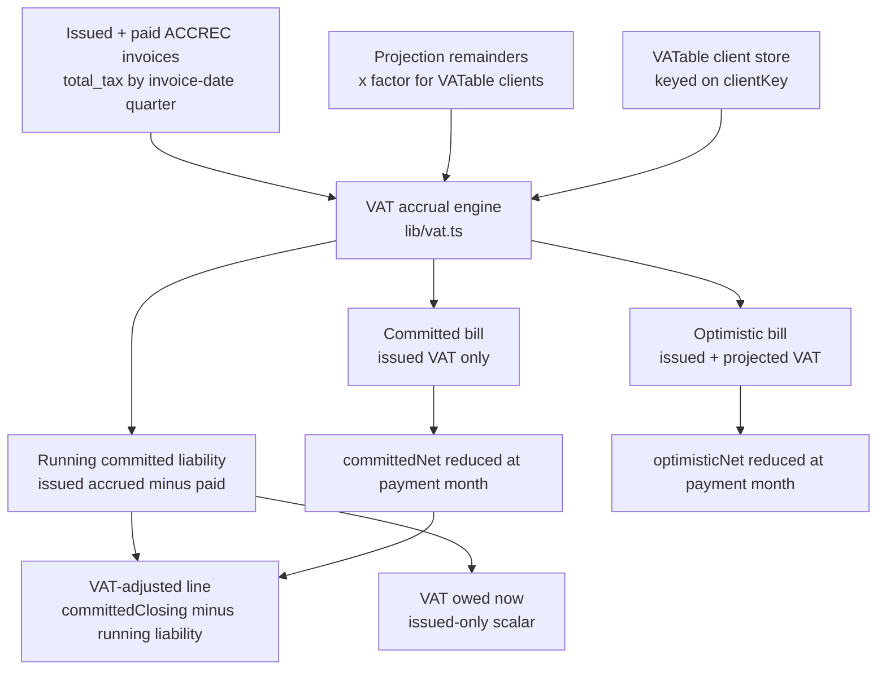

# feat: VAT modelling in the cashflow forecast

## Summary

Make the forecast account for the output VAT Jim owes HMRC, so the committed balance stops overstating spendable cash. Read Xero's real per-invoice tax for issued and paid ACCREC invoices, apply the standard rate (1/6 of the VAT-inclusive amount at 20%) to VATable clients' projections, accrue by quarter, and drop each quarter's bill as a cash outflow when it falls due. The committed walk carries only VAT on invoices actually issued; projected VAT rides the optimistic walk. Surface a dedicated VAT cost row, a "VAT owed now" stat, and a VAT-adjusted balance line that stays continuous across payment dates. VAT ships behind a per-connection flag so the forecast degrades to today's behaviour until it is switched on.

---

## Problem Frame

The cashflow route counts the full VAT-inclusive cash coming in but never subtracts the quarterly VAT payment going out (verified: no tax column synced, no per-client flag, no accrual, no quarterly bucket). The committed line, the one figure Jim leans on, runs too high by roughly the accrued-but-unpaid VAT. This plan closes that hole for the standard accrual scheme, output VAT only. Input VAT and credit-note reversals stay out of v1 (see origin: `docs/brainstorms/2026-07-07-vat-modelling-requirements.md`).

The work sits on top of the income pipeline (three layers per client: paid, invoiced, projected) and the two balance walks (committed, optimistic) in `apps/api/src/app/api/cashflow/route.ts`. The committed walk is cash plus invoices sent minus cost forecasts and "never includes hope"; optimistic adds unfulfilled projection remainders. VAT must respect that split: certain VAT (on issued invoices) belongs to committed, projected VAT belongs to optimistic. VAT is a per-invoice fact keyed on the invoice date, so it is computed alongside the pipeline, not by multiplying layer sums.

---

## Key Technical Decisions

- KTD1. **Sync Xero's real per-invoice tax; NULL means un-synced, distinct from a genuine zero.** Add `total_tax numeric(15,2)` (nullable) to `xero_invoices` and map `TotalTax` in `mapInvoice()`. `NULL` = not yet backfilled (fall back to a VATable-aware estimate at read time), `0` = genuine out-of-scope zero (IKEA). Never derive a real invoice's VAT with a blind `total/6`, that would invent 20% on an un-healed IKEA invoice and ignore mixed or zero-rated lines Xero already reflects.

- KTD2. **VATable is a client property in a new connection-scoped store, keyed on the existing `clientKey()`.** A client with only real invoices has no `income_projections` row, so a projection column cannot carry VATable status. Key the flag on the same `clientKey()` used for the income rollup (`contact:<id>` / `label:<normalised>`). Seed a client's default VATable only from invoices where `total_tax IS NOT NULL`: a client with non-zero tax seeds VATable, a client whose backfilled invoices all read zero (IKEA) seeds non-VATable. A client with no invoices, only NULL (un-backfilled) invoices, or projections only is **unknown** and defaults to VATable, consistent with `UNASSIGNED`. This keeps the unknown case pessimistic (the safe direction); seeding a genuinely VATable client non-VATable would silently miss VAT and overstate cash.

- KTD3. **Accrue output VAT alongside the pipeline, split by certainty, reusing `expandProjection`.** Committed VAT accrues from real `total_tax` (issued invoices, any payment status) bucketed by invoice-date quarter. Projected VAT accrues from VATable clients' projection remainders bucketed by expected-month quarter, and belongs to the optimistic walk only. Projected VAT uses the factor `rate/(100+rate)` (1/6 at 20%), derived from the rate constant, never a hardcoded 1/6. For a single-occurrence projection, use `expandProjection`'s consumption-netted remainder. For recurring projections, reconcile at the projection level: projected VAT = `max(0, projection amount − Σ live assigned invoice totals) × factor`, so an invoice that buckets outside the occurrence series still decays the projected VAT (per-occurrence remainder alone does not, and would double-count against the invoice's own tax). Skip lapsed occurrences, mirroring the income layer (`route.ts:477`), so VAT is never accrued into an already-closed quarter.

- KTD4. **One issued-based running liability drives both the headline and the adjusted line.** "VAT owed now" (R9) and the committed VAT-adjusted line (R10) use the same figure: cumulative committed (issued-invoice) VAT accrued minus committed bills paid. Because the committed walk drops by the issued-VAT bill at each payment month and this liability drops by the same amount, the adjusted line (`committedClosing − runningCommittedLiability`) stays continuous by construction (AE5). Projected VAT never enters this figure; it affects only the optimistic walk. This resolves the R9/R10 ambiguity in the origin: both are the same conservative issued-only number.

- KTD5. **Two per-walk bills; project current and future quarters only; a paid bill sits in cash history.** The committed walk's outflow is issued-invoice VAT only; the optimistic walk's outflow is issued + projected VAT. Because `optimisticNet = committedNet + projected income`, the extra projected-VAT term is subtracted alongside the projected income that generates it, so neither walk is charged VAT on income it does not count. Project a quarter's bill in its payment month only when that month is the current month or later. A quarter whose payment month is in the past is assumed already paid (its outflow is an untagged bank transaction already in the cash anchor, per R7), so it is not projected. The current quarter's bill is projected until Jim marks it paid (U8), which clears the transient double-count once he pays it by untagged transfer. A genuinely overdue-and-unpaid bill is not auto-detected in v1 (see Open Questions).

- KTD6. **The quarterly bill is a standalone synthetic display row, applied per-walk, never in the cost pools.** Apply the per-walk bill directly in the `committedNet`/`optimisticNet` computation, and separately emit a display-only VAT row in the response for the grid. The row must NOT feed the `outflows` sum (that would double-subtract), must NOT enter `actualMonthNet` (that would double-subtract at the current-month anchor), and must NOT enter the 3-month cost average pool (that would project phantom VAT into non-payment months). It carries values only in payment months and is non-editable. It must NOT route through `projection_overrides` (costs-only since migration 008).

- KTD7. **Backfill tax via a dated re-sync, not the normal heal.** `healInvoiceStatuses()` only re-fetches locally-open invoices, so PAID invoices in the open and prior quarters never get `total_tax`. Add a re-fetch that selects all local ACCREC invoice IDs with invoice date on/after the prior-quarter start and re-maps them through `fetchInvoicesByIds()` (which bypasses the status filter). Run once after the migration deploys, or "VAT owed now" reads low.

- KTD8. **Ship VAT dark, and degrade gracefully.** A per-connection `enabled` flag (default false) gates VAT. When it is off, or when the VAT tables are absent, the cashflow route returns today's shape (no VAT row, no owed figure, no adjusted line) rather than failing. This removes the single-point-of-failure in the two-migration + manual-backfill + auto-deploy sequence: a route that ships before its migration, or before the backfill runs, degrades instead of 500ing the whole dashboard. Flip `enabled` on only after the migrations and the U2 backfill are confirmed live.

- KTD9. **The VAT-adjusted line is present-and-future only, added as a third `AlignedChart` series.** History is cash-only, so no backward reconstruction. `AlignedChart` currently hardcodes two series plus the band, so a third line is a real change (new prop, path, legend) and must be mirrored in `CashflowMobile`. New contract fields are additive, but the versioned localStorage warm-start is the only guard against a stale payload crashing the no-typecheck web build, so bump the cache key to `cashflow_cache_v3` AND make every read of the new fields nil-safe.

---

## High-Level Technical Design

VAT is computed in a dedicated helper that reads the same invoice and projection data the pipeline reads, buckets output VAT by quarter, and returns four things the route wires in: the committed (issued-only) per-quarter bill, the optimistic (issued + projected) per-quarter bill, the running committed liability series (drives the adjusted line and the owed-now scalar), and the display-only VAT row.

Quarter timing (Flux quarter-ends 31 May / 31 Aug / 30 Nov / 28-29 Feb; constants in `lib/vat.ts`): a quarter's bill is due one calendar month and seven days after its quarter-end (quarter ending 31 Aug pays ~7 Oct). The payment lands in the walk in its due month, only when that month is the current month or later.

---

## Requirements

Carried from the origin requirements doc; grouped by concern. R-IDs match the origin.

**VAT computation**

- R1. Output VAT per income item: real `total_tax` from Xero for issued and paid ACCREC invoices; the standard rate applied to VATable clients' projections, zero to non-VATable.
- R2. VATable status is a per-client setting (PropellerNet, Regent VATable; IKEA not); the flag governs projections, real invoices carry their own tax.
- R3. Input VAT is not netted in v1; the modelled bill sits at or above the true bill.

**Quarterly liability and payment**

- R4. Output VAT accrues by invoice-date quarter; Flux quarters end 31 May, 31 Aug, 30 Nov, 28-29 Feb.
- R5. Each quarter's bill is a single cash outflow due one calendar month and seven days after the quarter-end.
- R6. The VAT payment reduces the balance walks: issued-VAT reduces committed, issued + projected VAT reduces optimistic.
- R7. Only current and future quarters are projected; a past-due bill already sits in cash history.

**Presentation**

- R8. A dedicated VAT line in the costs section, zero in most months and the bill in payment months.
- R9. A running "VAT owed now" figure (issued invoices in the open quarter, not projections).
- R10. A VAT-adjusted balance line (committed minus the running committed liability), continuous across payment dates.

---

## Implementation Units

### U1. Sync invoice-level VAT tax from Xero

- **Goal:** Capture Xero's per-invoice `TotalTax` on sync and store it, distinguishing un-synced (NULL) from genuine zero.
- **Requirements:** R1. Advances KTD1.
- **Dependencies:** none (prerequisite for everything downstream).
- **Files:**
  - `apps/api/supabase/migrations/010_invoice_vat.sql` (create): `alter table xero_invoices add column if not exists total_tax numeric(15,2)` (nullable, no default).
  - `apps/api/src/types/xero.ts` (modify): add `TotalTax?: number` to `XeroInvoice`.
  - `apps/api/src/lib/xero/sync.ts` (modify): add `total_tax: inv.TotalTax ?? null` to the `mapInvoice()` return (~line 251 block).
  - `apps/api/src/lib/xero/sync.test.ts` (modify).
- **Approach:** `mapInvoice()` writes only the keys present in its returned object, so adding `total_tax` flows through every path that calls it (main sync, by-ID fetch, heal) automatically. Leave the column nullable with no default so historical rows read NULL until backfilled (U2), keeping NULL distinct from a real 0.
- **Patterns to follow:** the existing money-field maps in `mapInvoice()` (`total: inv.Total`); the additive-migration style of `007_income_pipeline.sql` / `009_recurring_projections.sql`.
- **Test scenarios:**
  - `mapInvoice()` with `TotalTax: 200` produces a row with `total_tax === 200`.
  - `mapInvoice()` with `TotalTax: 0` produces `total_tax === 0` (genuine zero preserved, not coerced to null).
  - `mapInvoice()` with no `TotalTax` key produces `total_tax === null`.
- **Verification:** a fresh sync populates `total_tax` on newly fetched invoices; the column survives re-sync. Confirm `TotalTax` is actually present in a live Xero invoice payload before relying on it (dossier: almost-certainly-present but untyped).

### U2. Backfill tax onto existing invoices via a dated re-sync

- **Goal:** Populate `total_tax` on already-synced ACCREC invoices in the open and prior quarters, including PAID ones the normal heal skips.
- **Requirements:** R1, R9. Advances KTD7.
- **Dependencies:** U1.
- **Files:**
  - `apps/api/src/lib/xero/sync.ts` (modify): add a re-fetch that collects local ACCREC invoice IDs with invoice date on/after the prior-quarter start and runs them through `fetchInvoicesByIds()`.
  - `apps/api/src/app/api/sync/route.ts` (modify): accept a trigger for the tax backfill (e.g. `{ backfillTax: true }`), mirroring the existing `{ heal: true }` shape.
  - `apps/api/src/lib/xero/sync.test.ts` (modify).
- **Approach:** `fetchInvoicesByIds()` bypasses the status filter, so it re-fetches PAID invoices that `healInvoiceStatuses()` (locally-open only) would miss. Select ID + invoice date locally, filter to prior-quarter-start onward, batch through the existing 40-per-request by-ID path. One-off deploy step, not a scheduled job.
- **Patterns to follow:** `fetchInvoicesByIds()` and the payments backfill that already calls it (`sync.ts` ~400-413); the `{ heal: true }` route branch.
- **Test scenarios:**
  - Given local ACCREC invoices with `total_tax` null across several months, the backfill re-fetches only those with invoice date >= prior-quarter start and populates their `total_tax`.
  - A PAID invoice in the open quarter (which heal would skip) is included in the backfill set.
  - Invoices before the prior-quarter start are left untouched (bounded scope).
- **Verification:** after running the backfill against the live connection, issued and paid invoices in the open and prior quarters carry `total_tax`; older rows may remain null and are handled by the read-time fallback (KTD1).

### U3. VATable client store, VAT state, and constants

- **Goal:** Persist which clients are VATable, the dark-launch flag, and the paid-quarter markers; hold the rate and quarter-ends as constants.
- **Requirements:** R2, R4, R5. Advances KTD2, KTD8.
- **Dependencies:** none for the schema; seeding reads invoice tax (benefits from U2).
- **Files:**
  - `apps/api/supabase/migrations/011_vat_settings.sql` (create): `vatable_clients` (`connection_id`, `client_key text`, `vatable boolean`, unique on `(connection_id, client_key)`) and a per-connection singleton `vat_state` (`connection_id` unique, `enabled boolean default false`, `paid_quarters text[]` for marked-paid quarter keys).
  - `apps/api/src/lib/vat.ts` (create, shared with U4): the rate constant (20) and quarter-end months (05, 08, 11, 02) as literals; the quarter model (quarter-end and payment-due-date from a date); helpers to read `vat_state`, resolve a client's VATable status (store value, else seeded default), and the marked-paid set.
  - `apps/api/src/app/api/vat/route.ts` (create): GET `enabled` + resolved VATable client list + paid-quarter markers; PATCH to set a client's flag, toggle `enabled`, and mark/unmark a quarter paid.
  - `apps/api/src/lib/vat.test.ts` (create).
  - `packages/types/src/index.ts` (modify): types for the VAT state and VATable client entries.
- **Approach:** model `vat_state` on the `cash_thresholds` singleton precedent and `vatable_clients` on the row-per-entity precedent. The rate and quarter-ends are fixed facts of a single VAT registration, so they are constants, not stored config, keeping the persisted surface to exactly what changes: per-client VATable overrides, the dark-launch flag, and paid-quarter markers. Resolve VATable per `clientKey()`: explicit store value wins; absent, seed per KTD2 (VATable only from `total_tax IS NOT NULL` invoices with non-zero tax; unknown defaults VATable).
- **Patterns to follow:** `cash_thresholds` (`001_initial_schema.sql`) for the singleton; the projections route (`apps/api/src/app/api/projections/route.ts`) for the Zod + double-keyed `.eq('id').eq('connection_id')` CRUD idiom; `clientKey()` in `pipeline.ts`.
- **Test scenarios:**
  - A client_key with explicit `vatable=false` resolves non-VATable even if its invoices carry tax.
  - A client_key with no store row and invoices carrying `total_tax > 0` seeds VATable.
  - A client_key with no store row and only zero-tax (non-null) invoices (IKEA) seeds non-VATable.
  - A client_key with no store row and only NULL-tax (un-backfilled) invoices, or no invoices at all, seeds VATable (unknown → pessimistic).
  - `UNASSIGNED` resolves VATable by default.
  - The quarter model derives quarter-end 31 Aug and payment due ~7 Oct from a date in that quarter.
  - PATCH scopes flag, `enabled`, and paid-quarter changes to the connection.
- **Verification:** GET returns `enabled`, resolved flags, and paid-quarter markers; PATCH persists each; the quarter model produces the four correct quarter-ends and payment dates.

### U4. VAT accrual engine

- **Goal:** Compute the committed and optimistic per-quarter bills, the running committed liability series, and the owed-now scalar.
- **Requirements:** R1, R3, R4, R9, R10. Advances KTD3, KTD4.
- **Dependencies:** U1, U3.
- **Files:**
  - `apps/api/src/lib/vat.ts` (modify): the accrual functions.
  - `apps/api/src/lib/vat.test.ts` (modify).
- **Approach:** Committed VAT per quarter = sum of issued ACCREC invoices' output VAT bucketed by invoice-date quarter, where output VAT = `total_tax` when present, else a VATable-aware fallback (`total × factor` only when the client is VATable, else 0). Projected VAT per quarter (optimistic only) = for each VATable client's projection, `max(0, amount − Σ live assigned invoice totals) × factor` for single-occurrence, and the same projection-level reconciliation for recurring projections, bucketed by the relevant expected month; skip lapsed occurrences. Factor = `rate/(100+rate)` from the constant. Running committed liability at month `i` = cumulative committed accrual with quarter start <= `i`, minus committed bills whose payment month <= `i`. "VAT owed now" = committed accrual in the open quarter minus committed bills paid.
- **Patterns to follow:** `expandProjection()`, `clientKey()`, and `round()` in `pipeline.ts` / the cashflow route; the lapsed-skip at `route.ts:477`; reuse rather than reimplement consumption logic.
- **Test scenarios:**
  - Covers AE1. An IKEA invoice with `total_tax = 0` contributes 0 committed VAT; a PropellerNet invoice with `total_tax = 2000` contributes 2000 to its invoice-date quarter.
  - Covers AE2. A £6,000 VATable projection remainder accrues £1,000 projected VAT; a £5,000 non-VATable projection accrues 0.
  - Covers AE9. A quarter with only projections produces zero committed VAT and non-zero optimistic VAT.
  - A single-occurrence projection partly consumed by a real invoice accrues projected VAT only on the residual (no double-count with the invoice's tax).
  - A recurring projection with an assigned invoice bucketing outside the occurrence series still decays projected VAT (projection-level reconciliation), so the invoice's VAT is not double-counted.
  - A recurring projection with overdue floored invoices does not accrue projected VAT into lapsed (past) occurrences.
  - An invoice with `total_tax = null` for a VATable client falls back to `total × factor`; for a non-VATable client falls back to 0.
  - A part-paid invoice accrues its full `total_tax`, independent of `amount_paid`.
  - The running committed liability drops by exactly the committed bill at the payment month (so `committed − liability` is continuous there).
  - "VAT owed now" counts issued invoices in the open quarter only and excludes projections.
  - The factor is `rate/(100+rate)` (0.1667 at rate 20), not a literal 1/6.
- **Verification:** unit tests cover the fallback matrix, single vs recurring projection reconciliation, lapsed handling, quarter bucketing, and the liability/owed arithmetic; numbers match AE1, AE2, AE9, and the AE5 continuity relationship.

### U5. Wire VAT into the cashflow route

- **Goal:** Inject the per-walk bills, compute the VAT-adjusted series and owed-now scalar, and degrade gracefully when VAT is off.
- **Requirements:** R5, R6, R7, R8, R9, R10. Advances KTD5, KTD6, KTD8.
- **Dependencies:** U4.
- **Files:**
  - `apps/api/src/app/api/cashflow/route.ts` (modify): read `vat_state`; when disabled or the VAT tables are absent, return today's shape. When enabled: build the committed and optimistic bills per payment month (current or later; skip past-due quarters; skip quarters marked paid); reduce `committedNet[i]` by the committed bill and `optimisticNet[i]` by the optimistic bill; compute `vatAdjustedClosing[i] = committedClosing[i] − runningCommittedLiability[i]`; add the `vatOwedNow` scalar; emit the display-only VAT row (payment-month values only); add a dedicated ACCREC query (invoice date >= prior-quarter start, any status, selecting issue date and `total_tax`) so both paid-this-quarter and prior-quarter invoices are available to the engine.
  - `apps/api/src/app/api/cashflow/route.test.ts` (modify).
- **Approach:** the two bills are applied directly in the `committedNet`/`optimisticNet` loop (KTD6); the display-only VAT row is appended after `buildCostAccounts` and excluded from the `outflows` sum, `actualMonthNet`, and the average pool. Past-due quarters are assumed paid (R7), so they are not projected; the current quarter's bill is skipped when marked paid (U3). Keep the cash-basis invariants: past months stay cash-only and `closing − opening === net` after the outflow is injected. The read query is widened to prior-quarter start to match the U2 backfill, so a current-quarter bill can include prior-quarter issued invoices.
- **Patterns to follow:** the balance-walk construction and `fallsBelow()` (`route.ts:650-720`); `buildCostAccounts` for the row shape; the graceful-degradation posture used elsewhere for optional data.
- **Test scenarios:**
  - Covers AE3. A quarter carrying £30,000 issued VAT produces a £30,000 committed outflow in its payment month; the optimistic bill adds that quarter's projected VAT.
  - Covers AE9. A quarter with only projections produces no committed VAT outflow but reduces the optimistic walk.
  - Covers AE4/AE10. A quarter whose payment month is past produces no outflow (assumed paid); marking the current quarter paid removes its outflow.
  - Covers AE5. Running committed liability £18,000, committed closing £50,000, adjusted closing £32,000; at the payment month committed drops by the committed bill and the adjusted line stays continuous.
  - When `enabled` is false, the response matches today's shape (no VAT row, no owed figure, no adjusted line) and the route does not error if the VAT tables are missing.
  - `closing[i] − opening[i] === committedNet[i]` holds for every month after the VAT outflow is injected; `actualMonthNet` is unchanged by VAT and the VAT row's non-payment months are exactly zero.
  - The open/prior-quarter query returns issued ACCREC invoices of any status (including PAID) for the owed-now and committed-bill figures.
- **Verification:** with VAT enabled the response carries the VAT row, `vatOwedNow`, and `vatAdjustedClosing`; committed reflects issued VAT only, optimistic reflects issued + projected; the walk identity holds; disabling VAT returns the pre-VAT response.

### U6. Extend the shared contract and MCP descriptions

- **Goal:** Add the VAT fields to the response contract, bump the web cache, and expose the fields through the read surfaces.
- **Requirements:** R8, R9, R10. Advances KTD9.
- **Dependencies:** U5 (shape known).
- **Files:**
  - `packages/types/src/index.ts` (modify): add optional `vatOwedNow?: number` and `vatAdjustedClosing?: number[]` to `CashflowResponse`, and the display-only VAT row representation.
  - `apps/web/src/lib/api.ts` (modify): bump `CASHFLOW_CACHE_KEY` to `cashflow_cache_v3`.
  - `apps/web/src/lib/types.ts` (modify): add any new type names to the re-export list.
  - `apps/mcp/src/index.ts` (modify): update the `get_cashflow` description to document the VAT row, owed-now figure, and adjusted line.
  - `apps/mcp/README.md`, `CLAUDE.md` (modify): note the VAT fields.
- **Approach:** fields are optional so an absent/disabled-VAT payload is valid; the `v3` cache bump plus nil-safe reads in U7 guard the no-typecheck web build against a stale `v2` payload on deploy day. MCP tools are thin passthroughs, so the fields flow through with only description edits.
- **Patterns to follow:** the existing `CashflowResponse` fields, the `cashflow_cache_v2` precedent, and the `@floaters/types` re-export shim.
- **Test scenarios:** `Test expectation: none` for the type/description/cache-key edits (no behavioural logic); the contract is exercised by U5 and U7 tests.
- **Verification:** `npm run build` typechecks `apps/api` and `packages/types` cleanly; the cache key reads `v3`; MCP descriptions mention the VAT fields.

### U7. Web presentation: VAT row, owed stat, adjusted line

- **Goal:** Render the VAT cost row (non-editable and visibly so), a "VAT owed now" stat card, and the VAT-adjusted balance line, on desktop and mobile.
- **Requirements:** R8, R9, R10. Advances KTD9.
- **Dependencies:** U6.
- **Files:**
  - `apps/web/src/components/AlignedChart.tsx` (modify): add a `vatAdjustedClosing` prop and a third line.
  - `apps/web/src/pages/CashflowPage.tsx` (modify): render the non-editable VAT row, the stat card, and wire the adjusted series.
  - `apps/web/src/components/CashflowMobile.tsx` (modify): mirror the three.
  - relevant component test files.
- **Approach:**
  - VAT row: render as a distinct non-editable row, muted text with a lock or "auto" affordance, `cursor: default`, no hover/focus edit state, and a tooltip "VAT is calculated automatically", so it does not read as a clickable cost cell that silently ignores clicks.
  - Adjusted line: a solid line in a distinct colour (not reusing the committed foreground or the optimistic amber), drawn beneath the committed line and outside the committed/optimistic band, with its own legend entry. Always-on (Jim chose the fullest option); no toggle in v1.
  - Owed stat: a third stat card next to `currentBalance` / `fallsBelowZeroIn`, with a tooltip noting it is VAT on issued invoices this quarter (the adjusted line uses the same figure; projected VAT shows only on the optimistic line), so the numbers do not read as inconsistent.
  - States: while cashflow data loads or errors, the card and row follow the existing grid's loading/error treatment; when VAT is disabled or the connection has no VATable clients, hide the VAT row, stat, and adjusted line rather than showing a permanently-£0 row that reads as broken.
  - Mobile: mirror on `CashflowMobile` with a simplified legend and adequate touch targets; do not assume a pixel-identical three-line chart on a narrow viewport.
  - All reads of `vatOwedNow` / `vatAdjustedClosing` / the VAT row are nil-safe (KTD9).
- **Patterns to follow:** the existing stat cards (`CashflowPage.tsx:169-183`), `AccountRow`/`EditableCell` for the row with the editable behaviour suppressed, and the two-series line construction in `AlignedChart` (`:95-113`, legend `:222-233`).
- **Test scenarios:**
  - The VAT row shows zero in non-payment months and the bill in payment months, is rendered with the non-editable affordance, and writes no override on interaction.
  - The "VAT owed now" card renders the issued-only figure from the response.
  - `AlignedChart` renders three lines when `vatAdjustedClosing` is supplied, and the adjusted line sits at or below committed.
  - With VAT disabled or no VATable clients, the VAT row, stat, and adjusted line are absent (not zero-valued).
  - A `v2`-shaped payload (missing the new fields) renders without crashing (nil-safe).
  - The mobile view shows the VAT row, stat, and adjusted line.
- **Verification:** `npm run build` is clean; the grid shows the VAT row, stat card, and third line on desktop and mobile, and hides them cleanly when VAT is off.

### U8. VATable client management, dark-launch toggle, and mark-VAT-paid

- **Goal:** Let Jim toggle which clients are VATable, switch VAT on, and mark a quarter's bill paid.
- **Requirements:** R2, R7. Advances KTD5, KTD8.
- **Dependencies:** U3, U5.
- **Files:**
  - `apps/web/src/components/AccountManagementPanel.tsx` (modify): add a VAT section with per-client VATable toggles, the "Enable VAT" switch, and the rate/quarter facts shown read-only. Reached from the existing management-panel entry point on the cashflow page (no new navigation).
  - a "mark VAT paid" control inline on the current quarter's VAT row cell (with an un-mark affordance and a clear marked state), persisted so U5's projection skips that quarter.
  - `apps/api/src/app/api/vat/route.ts` (modify): accept the paid-quarter and enabled flags (built in U3).
  - relevant test files.
- **Approach:** the toggle list reads resolved VATable flags (store value or seeded default) and PATCHes overrides via the optimistic-mutation pattern. "Enable VAT" is the dark-launch switch Jim flips after the backfill. "Mark VAT paid" records the paid quarter so U5 stops projecting it, resolving the one transient double-count (a current-quarter bill already paid via untagged transfer). Keep controls minimal: one VATable toggle per client, one enable switch, one mark-paid control per relevant quarter.
- **Patterns to follow:** the existing management panel layout and entry point; the optimistic-mutation pattern in `EditableCell.tsx`.
- **Test scenarios:**
  - Toggling a client VATable off makes its projections stop accruing VAT on the next cashflow read.
  - Enabling VAT surfaces the VAT row/stat/line; disabling hides them.
  - Marking the current quarter paid removes its projected bill; un-marking restores it.
- **Verification:** toggles and the enable switch persist and change the forecast; the mark-paid control clears and restores the current bill; controls are keyboard-reachable following the panel's existing component patterns.

---

## Acceptance Examples

Carried from origin (AE1-AE5) plus design-clarification examples (AE6-AE10).

- AE1. **Covers R1, R2.** IKEA invoice `total_tax = 0` contributes £0; PropellerNet invoice `total_tax = 2000` contributes £2,000 committed VAT.
- AE2. **Covers R1, R2.** £6,000 VATable projection accrues £1,000 projected VAT; £5,000 non-VATable projection accrues £0.
- AE3. **Covers R4, R5, R6.** A quarter carrying £30,000 issued VAT produces a £30,000 committed outflow in its payment month; the optimistic bill adds that quarter's projected VAT.
- AE4. **Covers R7.** A quarter whose payment month is past produces no outflow (assumed paid, in the cash anchor).
- AE5. **Covers R10.** Running committed liability £18,000, committed closing £50,000, adjusted closing £32,000; at the payment month committed drops by the committed bill and the adjusted line stays continuous.
- AE6. **Covers R2, KTD2.** A VATable client with only un-backfilled (NULL-tax) invoices or projections only seeds VATable, not non-VATable.
- AE7. **Covers R1, KTD1.** An un-backfilled invoice (`total_tax` null) for a VATable client falls back to `total × factor`; a synced IKEA invoice (`total_tax = 0`) contributes £0.
- AE8. **Covers R9, KTD4.** "VAT owed now" and the adjusted-line liability are the same issued-only figure; projected VAT appears only on the optimistic walk.
- AE9. **Covers R6, KTD5.** A quarter with only projections produces no committed VAT outflow and a non-zero optimistic VAT outflow.
- AE10. **Covers R7, KTD5.** A current-quarter bill is projected until marked paid, then excluded; a recurring projection's out-of-series invoice does not double-count VAT.

---

## Scope Boundaries

**Deferred for later**
- Input VAT (reclaim on costs). A v2 refinement; needs cost VAT from Xero bills plus an assumed rate on forecast/averaged costs.

**Outside this product's identity**
- Not a VAT-return or filing tool: no MTD submission, no threshold tracking, no reconciliation against filed returns.
- No support for flat-rate or cash-accounting schemes; Flux is standard accrual.
- Editable VAT rate or quarter-stagger settings: both are fixed facts of a single registration, held as constants, not user config.

**Deferred to follow-up work**
- Credit-note VAT reversal: credit notes are not synced, so a credit-noted sale keeps its full `total_tax` and over-accrues VAT slightly. Errs pessimistic; the same known pipeline limitation.
- Automatic reconciliation of untagged HMRC payments so genuinely-overdue-and-unpaid bills can be detected (v1 assumes past-due bills are paid).

---

## Risks & Dependencies

- **Deploy ordering (mitigated).** The route reads `total_tax` and the VAT tables. Apply migrations 010 and 011 to hosted Supabase BEFORE the API deploys, run the U2 backfill, then flip `enabled` on. KTD8's graceful degradation removes the hard failure mode: if the code lands before the migration or backfill, VAT stays off and the dashboard serves today's shape rather than 500ing. Verify on Railway (~45s; pushed is not live) before enabling.
- **`TotalTax` payload assumption.** The plan assumes Xero returns `TotalTax` on the invoice object (dossier: almost-certainly-present but untyped). Confirm against a live payload in U1; if absent, fall back to the VATable-aware estimate everywhere.
- **Backfill coverage.** Invoices older than the prior quarter stay `total_tax` null and rely on the read-time fallback. Acceptable because accrual only needs the open and near quarters, but "VAT owed now" depends on U2 having run before `enabled` is flipped on.
- **GBP assumption.** VATable clients (PropellerNet, Regent) are assumed to invoice in GBP; the pipeline already treats `total`/`amount_due` as GBP. Verify during U4; IKEA is out-of-scope so its currency does not bite.

---

## Open Questions (Deferred to Implementation)

- **Projection quarter-attribution near a boundary.** VAT accrues on the invoice date, but projections carry only an expected (payment) month. The plan uses expected-month = accrual-month (KTD3); a projection expected in the first month of a quarter may have been invoiced in the prior quarter, shifting its bill by three months. Resolve the exact proxy during U4 and pin it with a test; the safe default is expected month.
- **Genuinely-overdue-and-unpaid VAT.** v1 assumes a past-due bill is paid (KTD5, R7). If Jim is genuinely behind on a VAT payment, the forecast will not reflect that liability (overstates cash). Documented as a v1 limitation; automatic untagged-payment reconciliation is deferred to follow-up.
- **Floored-consumption quarter attribution for recurring projections.** When overdue invoices floor their bucket month to the current month, decide whether the consumed VAT is attributed to the occurrence's original quarter or the floored month; settle in U4 with a quarter-boundary test.

---

## Sources / Research

- Origin requirements: `docs/brainstorms/2026-07-07-vat-modelling-requirements.md` (R1-R10, AE1-AE5, decisions).
- Balance walks and income pipeline: `apps/api/src/app/api/cashflow/route.ts:650-758` (committed/optimistic construction, `fallsBelow`), `:477` (lapsed-skip), `:657-660` (committed excludes projected income).
- Projection expansion and client keys: `apps/api/src/lib/pipeline.ts:156-216` (`expandProjection`, out-of-series consumption note), `:223-230` (`clientKey`).
- Xero sync: `apps/api/src/lib/xero/sync.ts` (`mapInvoice` ~236-260, `fetchInvoicesByIds` ~334-355, `healInvoiceStatuses` ~424-433), `apps/api/src/types/xero.ts:20-43`.
- Config precedents: `apps/api/supabase/migrations/001_initial_schema.sql:119-135` (`cash_thresholds`, `account_groups`).
- Contract, cache, and web: `packages/types/src/index.ts:46-60`, `apps/web/src/lib/api.ts:14-18` (versioned warm-start cache), `apps/web/src/pages/CashflowPage.tsx:63-67,169-196`, `apps/web/src/components/AlignedChart.tsx:23-30,95-113,222-233`, `apps/web/src/components/CashflowMobile.tsx`.
- Migration/deploy runbook: `docs/DEPLOY-RAILWAY.md`; income-pipeline ordering precedent in `docs/plans/2026-07-06-001-feat-income-pipeline-plan.md`.
- Prior cash-basis architecture: `docs/plans/2026-07-03-001-fix-cashflow-cash-basis-plan.md` (walk invariants, tax-inclusive scaling).
